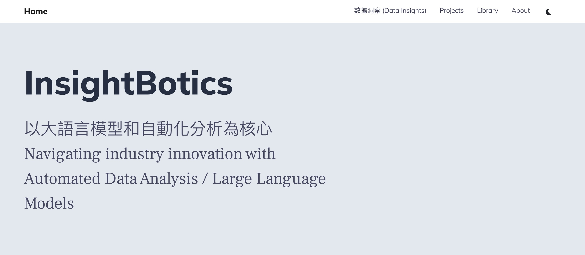
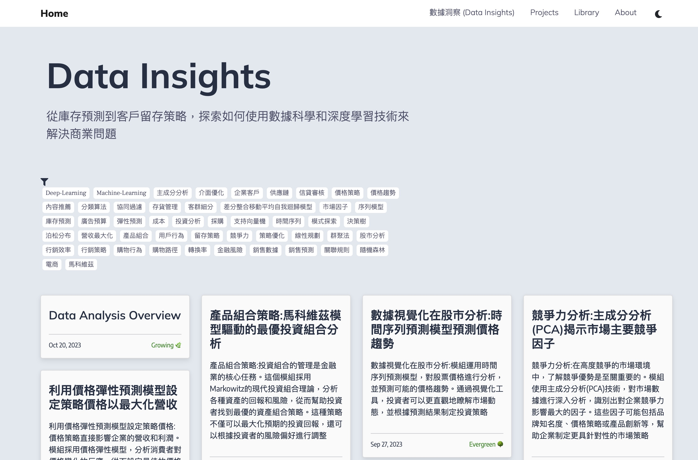

# InsightBotics Tech

[**Visit InsightBotics**](https://https://www.insightbotics.com/)


> 以大語言模型和自動化分析為核心 Navigating industry innovation with Automated Data Analysis / Large Language Models 


Our projects includes:
* 數據洞察 Data Insights  /posts
* 技術案例 Projects
* 影像生成 Library
* 關於我們 About 




企業商業數據-決策工具



## 提供服務 Getting started

1. 競爭對手即時監控系統、實時消費者行為分析引擎、輿論趨勢預測儀表板

    ```
    still drafting
    ```

2. 動態價格設定引擎、客戶留存預測系統、庫存最佳化分析工具

    ```
    still drafting
    企業的庫存管理是否高效，能否確保最佳的資金運作？
    是否已經確定哪些客戶最有可能流失？
    產品的價格設定是否反映了當前的市場狀況和競爭環境？
    企業的行銷策略是否基於真實的客戶行為和偏好？

    運用庫存最佳化分析工具，定期調整庫存策略，確保資金流動性並減少過剩庫存。
    使用客戶留存預測系統，確定高風險流失的客戶群，並為他們提供特殊優惠或服務。
    利用動態價格設定引擎，即時調整價格以最大化利潤並增加市場佔有率。
    定期分析客戶購買和互動數據，並根據該數據制定或調整行銷策略。
    設定固定的時間週期，如每季度，來評估和調整模型，確保其預測和分析的準確性。
    ```

3. Customize your site in `Chatgpt`. 使用ChatGPT演算法，為企業提供24/7即時客服，快速回應客戶問題，提升客戶滿意度。

    ```
    still drafting
    ```

4. 透過`教育經費贊助研究技術`企業社會責任計畫，公開展現對教育和研發的支持，同時提升企業的社會影響力。

    ```
    與高等學府的研究生建立深入合作，定期獲取研發進度，並結合企業需求進行技術轉移。透過贊助教育企業社會責任計畫，公開展現對教育和研發的支持，同時提升企業的社會影響力。藉由此贊助計畫，建立與研究生的早期聯繫，為未來的招募打下堅實的基礎。
    ```

### Website Support 

Submodule add from [Digital Garden Theme for Hugo](https://github.com/paulmartins/hugo-digital-garden-theme).

Run `hugo server --baseURL="http://localhost:1313/"` on the local server.


## 團隊 Teams

> 軟體領域：台大電機所博士生、中研院資訊科學所研究員、清大資訊系統與應用研究所研究生  
> 財金領域：台科大財務金融研究所博士、中國信託創投AO、財經M平方實習生  
> 生醫領域：台北醫學大學醫學資訊博士

If you have any suggestion, welcome to contact [william@insightbotics.com](mailto:william@insightbotics.com)